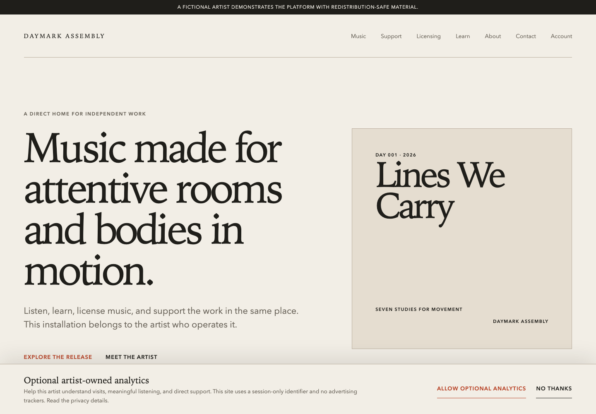
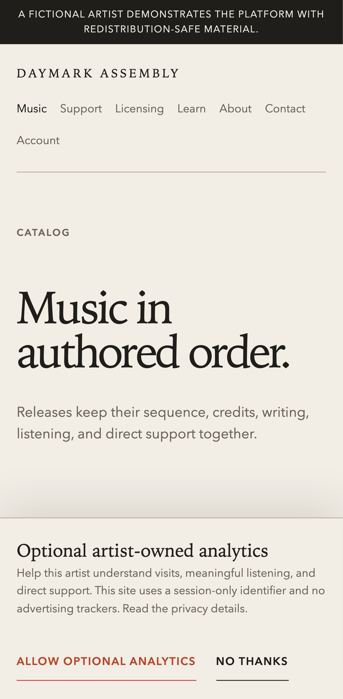
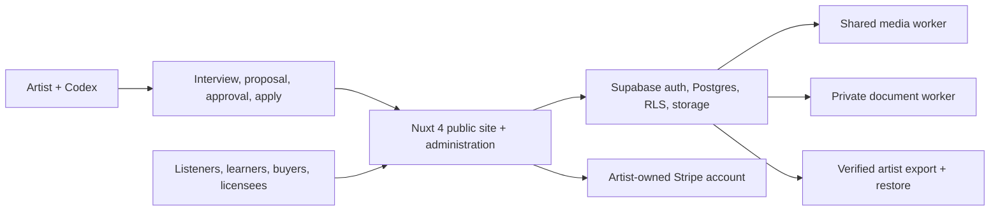

# Artist-Owned Platform

An open-source web platform for musicians who want a permanent home for their work and a direct relationship with the people who listen, learn, buy, and license it.

Each installation belongs to one artist or artist-led organization. The artist supplies the music, identity, writing, artwork, prices, licensing terms, and business decisions. The platform supplies the working foundation: catalog and listening, direct sales, licensing, memberships, learning paths, video, customer access, first-party telemetry, and the tools needed to operate it.

Codex helps the artist set up and maintain the system. The public website does not require an OpenAI API key or place an AI experience between the artist and their audience.





## What the complete platform includes

- A Nuxt 4 website with an artist-controlled design system and structured page publishing.
- Supabase database, authentication, optional OAuth, storage, Row Level Security, and customer accounts.
- Albums, tracks, collections, credits, artwork, audio previews, playlists, favorites, and listening history.
- Stripe test and live-mode integration for downloads, memberships, subscriptions, and customer billing tools.
- Configurable music licensing with issued terms, protected documents, and account history.
- Learning paths, courses, lessons, progress, video, and editorial publishing.
- First-party audience telemetry, operational status, protected media delivery, and artist portability.
- Human-readable instructions and agent-readable contracts for setup, verification, recovery, and ongoing change.

## Architecture



Supabase is authoritative for artist-editable runtime content and access state. Shared schemas define valid configuration and payloads. Environment variables remain authoritative for secrets. Stripe supplies verified payment facts while the application owns products, descriptions, prices, license terms, and entitlement decisions. Media and PDF work runs outside ordinary requests through durable leased jobs.

## How an artist begins

The intended starting point is simple:

> Help me set up my artist-owned site.

Codex reads `AGENTS.md` and `SETUP.md`, checks the local environment, and walks through the artist's identity, catalog, visual direction, pages, commerce, licensing, membership, teaching, video, privacy, and deployment choices. It prepares a structured proposal and preview. The artist approves the proposal before deterministic scripts change the project.

The setup lifecycle is:

    interview
    -> structured proposal
    -> validated preview and diff
    -> explicit human approval
    -> deterministic application
    -> verification
    -> project-state update

## Judge in five minutes

With Node 24.14, npm 11, Python 3.12 or newer, and Docker running:

```text
npm ci
npm run demo:local
```

The second command prepares the pinned PDF environment, runs preflight, installs and verifies the complete fictional Daymark Assembly state, and starts Nuxt at `http://127.0.0.1:3000`. Reset at any time with `npm run demo:reset`.

The complete role credentials, ten-minute product route, technical proof commands, and explicit external limitations are in [`docs/submission/judge-quickstart.md`](docs/submission/judge-quickstart.md). The final judging route and hosted plan are in [`docs/submission/judging-guide.md`](docs/submission/judging-guide.md) and [`docs/submission/hosted-test-plan.md`](docs/submission/hosted-test-plan.md).

## Current status

Milestones 0 through 11 and Integration Gate A are implemented locally. The repository now includes the Nuxt 4 and local Supabase foundation, explicit account roles and protected fulfillment, database-authoritative artist identity and design, validated private drafts, explicit publication, structured pages, consent-based contact storage, catalog and collection authorship, signed resumable media intake, one local/container processing worker, a persistent public player, private listener libraries, one-time commerce, memberships, refunds, cancellation, customer billing tools, protected downloads, auditable entitlements, explicit non-exclusive music licensing, immutable issued terms, private PDF delivery, ordered mixed-media learning paths, four learning access modes, progress and account resume, consent-gated video, safe rich text, editorial publishing, privacy-conscious first-party telemetry, redacted operations, a complete Codex-guided setup lifecycle, verified artist portability, production-shaped security and accessibility checks, explicit performance budgets, and executable recovery drills. The prepared media worker and Stripe integration still require explicitly approved hosted and sandbox connections before those external demonstrations can be recorded.

- Build record: `BUILD_WEEK.md`
- Complete execution plan: `plans/artistOwnedPlatform.md`
- Product contract: `docs/architecture/product-contract.md`
- Configuration authority: `docs/architecture/configuration-authority.md`
- Media processing: `docs/architecture/media-processing-contract.md`
- Capability evidence: `docs/submission/capability-evidence.md`
- Model and agent use: `docs/submission/model-and-agent-use.md`

## Requirements and supported environments

| Requirement        | Supported contract                                                            |
| ------------------ | ----------------------------------------------------------------------------- |
| Node and npm       | Node 24.14; npm 11; exact package graph in `package-lock.json`                |
| Local services     | Docker Desktop on macOS or a compatible Docker daemon on Linux                |
| Document rendering | Python 3.12 or newer; exact packages installed into ignored `.venv-documents` |
| Browsers           | Chromium and WebKit on macOS; Chromium, Firefox, and WebKit in Linux CI       |
| Deployment runtime | Ordinary Node-compatible host; Vercel is the documented initial path          |

Windows through WSL2 may work with Docker integration but is not yet a verified host contract. The public site is responsive; administration is designed for current desktop and mobile browsers.

## Development

Use Node 24.14, npm 11, and a running Docker Desktop installation. From a fresh clone:

    npm ci
    npm run setup:documents
    npm run setup:preflight
    npm run setup:local
    npm run dev

`setup:documents` creates an ignored, isolated Python environment for the pinned private-license PDF renderer. `setup:local` starts the local Supabase stack, applies migrations, inserts the fictional demonstration artist, generates `shared/types/database.ts`, and writes local credentials only to ignored `.env`.

Verify the current foundation with:

    npm run setup:check
    npm run test:db
    npm run verify:foundation
    npm run verify:spine
    npm run verify:administration
    npm run verify:catalog
    npm run verify:commerce
    npm run verify:licensing
    npm run verify:learning
    npm run verify:telemetry
    npm run verify:setup
    npm run verify:portability
    npm run verify:hardening
    npm run verify:recovery
    npm run verify:package
    npm run test:cross-browser
    npm run diagnose
    npm run verify
    npm run test:e2e

`verify:spine` performs a clean local reset, verifies setup state and all five database identities, replays one payment event four times, checks the single order and entitlement, builds the application, scans the browser bundle for server secrets, and runs the protected browser journey. `verify:administration` proves configuration and page draft/publication plus consent-based local contact storage. `verify:catalog` proves catalog authority, idempotent media intake, local and container media processing, and browser-secret boundaries. `verify:commerce` proves replay-safe fulfillment, changed-fact denial, subscription expiry, partial and full refunds, redacted webhook recovery records, raw-body Stripe signature verification, and customer isolation. `verify:licensing` proves immutable terms, replay-safe issue, private PDF rendering, account isolation, and refund revocation. `verify:learning` proves authored ordering, four access modes, private lesson media, progress, account isolation, safe content, and publication. `verify:telemetry` proves consent enforcement, global disablement, retention, raw-event isolation, operational separation, and diagnostic redaction. `verify:setup` proves the 14-topic interview, read-only preview, explicit approval guard, identity and two-track application, verification, external checkpoints, state update, idempotency, and output redaction. `verify:portability` proves deterministic versioned exports, structured and relationship validation, bundled-media hashes, private-data exclusion, explicit destructive-local confirmation, clean database restore, exact content-table comparison, anonymous public access, service reconnection checkpoints, tamper denial, and demonstration recovery. `verify:hardening` builds and starts the production server, checks the strict browser/request boundaries, keyboard and reduced-motion behavior, offline state, landmarks, viewports, axe results, four public-route performance budgets, database policies, and browser-secret boundary. `verify:recovery` proves safe setup reruns, payment reconciliation, media lease recovery, portable database/storage restore, and a final redacted installation check. `npm run diagnose` prints shareable aggregate and operational status without credentials, URLs, account identities, or raw sessions. `npm run test:e2e` resets the fictional demonstration before each specification so stateful desktop and mobile journeys remain deterministic. `npm run verify` runs the aggregate local gate.

`verify:package` validates the README, internal evidence links, fictional asset ledger, screenshots, browser-secret boundary, and the read-only public journey. On macOS it runs Chromium and WebKit; Linux CI also requires Firefox. Playwright Firefox 151 currently hangs before opening a page on this macOS host with [Mozilla's headless software-rendering failure](https://bugzilla.mozilla.org/show_bug.cgi?id=1832201), so that engine remains mandatory on the CI platform where its runtime starts reliably. Set `PLAYWRIGHT_FORCE_FIREFOX=1` to retry it locally. The original demonstration inventory is in [`docs/demo-assets.md`](docs/demo-assets.md).

The guided personalization command sequence and nontechnical explanation are in [`SETUP.md`](SETUP.md). Provider-neutral operations and recovery runbooks begin at [`docs/agent/README.md`](docs/agent/README.md). The local lifecycle records hosted Supabase, OAuth, Stripe, email, Vercel, DNS, and deployed media processing as approval checkpoints; it performs none of those external actions.

The security review is recorded in [`security_best_practices_report.md`](security_best_practices_report.md), recovery authority in [`docs/operations/recovery.md`](docs/operations/recovery.md), and the measured production budgets in [`docs/submission/performance-evidence.md`](docs/submission/performance-evidence.md).

## Security and recovery model

- Server-owned sessions use secure cookie behavior and explicit owner, editor, customer, anonymous, and service-role boundaries.
- Every exposed table combines narrow Data API grants with forced Row Level Security; consequential writes use server-only functions.
- Mutating requests refuse cross-site origins. Public links and redirect destinations pass centralized same-origin, HTTPS, loopback-development, or exact Stripe policies.
- Production responses carry a nonce content security policy and strict browser headers. Requests and sensitive routes have explicit size and rate boundaries.
- Source media is immutable; uploads, derivatives, documents, payment events, entitlements, and exports have durable identities and replay behavior.
- Local destructive commands refuse non-loopback Supabase targets. Recovery drills cover payment reconciliation, expired media leases, deterministic export, clean restore, and repeated setup.

This is a working security boundary, not a substitute for an artist's legal, tax, privacy, accessibility, or infrastructure review before public operation.

## Export and restore ownership

Create and verify a portable snapshot with:

    npm run export:artist -- --out exports/my-artist
    npm run export:verify -- exports/my-artist

The export contains deterministic structured artifacts and bundled media covered by SHA-256 hashes. It carries published artist configuration, pages, catalog and credits, product and licensing definitions, learning, video, editorial, privacy settings, application/schema versions, redacted service state, backup procedures, and storage-addressable media paths. It excludes secrets, provider identifiers, customers, messages, libraries, progress, analytics events, payments, subscriptions, issued licenses, drafts, signed URLs, and private task metadata.

Prove restoration only against disposable local Supabase:

    npm run restore:check -- exports/my-artist --confirm-disposable-local

The command refuses a hosted target and refuses to run without the explicit confirmation flag. It starts from migrations, creates a disposable local owner, restores and compares every portable content table and media hash, checks direct-public data and media, reports external-account reconnection runbooks, and then recreates the fictional demonstration. Hosted backups, customer-data exports, and real restoration follow [`docs/agent/backup-restore.md`](docs/agent/backup-restore.md) and require action-specific approval.

## Deployment and operating costs

The software will be open source after Michael selects the final license and explicitly approves publication. The initial documented path is a Node deployment on Vercel with an artist-owned Supabase project, Stripe account, domain, email provider, and a container-capable media worker. Ordinary Node-compatible hosting remains possible because the core application does not depend on a proprietary Vercel runtime.

Running a site may still involve domain registration, hosting, database, storage and egress, email, worker compute, and payment-processing costs. Free tiers can support evaluation but are provider-controlled and may change. Each artist owns their repository, connected accounts, domain, content, customer relationship, and a verified path for exporting and restoring the installation. No deployment, paid resource, DNS change, live payment, email send, or publication occurs without explicit approval.

## Contributing

Read [`CONTRIBUTING.md`](CONTRIBUTING.md), [`AGENTS.md`](AGENTS.md), the product contract, and the relevant architecture decision before changing behavior. Keep the single-artist authority model, human approval gates, fictional fixture boundary, and central entitlement decision intact. Add focused tests, run the relevant milestone gate, and update provenance and capability evidence for a new public claim. Never commit credentials, real customer data, private artist media, generated local exports, or machine-specific paths.

The final contribution and redistribution terms follow the project license Michael selects before public release. Until then, `package.json` correctly remains `UNLICENSED`.

## Troubleshooting

| Symptom                              | First check                                                  | Safe response                                                                  |
| ------------------------------------ | ------------------------------------------------------------ | ------------------------------------------------------------------------------ |
| Preflight reports the wrong Node     | `node --version`                                             | Activate Node 24.14, then rerun `npm ci` and `npm run setup:preflight`         |
| Docker or Supabase is unavailable    | `docker info` and `npm run setup:check`                      | Start Docker; rerun `npm run setup:local`                                      |
| Fictional data was changed           | `npm run demo:reset`                                         | Reset only the loopback Supabase installation                                  |
| License PDF dependencies are missing | `npm run setup:documents`                                    | Rebuild the ignored pinned Python environment                                  |
| A provider is not connected          | `npm run diagnose`                                           | Read the named runbook; seek approval before any external action               |
| A browser journey fails              | `playwright-report/` and `test-results/`                     | Preserve the evidence, reset the demo, and rerun the narrow specification      |
| A restore or payment fact disagrees  | [`docs/operations/recovery.md`](docs/operations/recovery.md) | Preserve hashes and provider facts; never hand-edit an entitlement or artifact |

Provider-specific diagnosis and recovery begin in [`docs/agent/troubleshooting.md`](docs/agent/troubleshooting.md).

## Build Week

This project is being built with Codex using GPT-5.6 Sol and GPT-5.6 Pro. Michael Wall directs the product, supplies the operating knowledge, and makes the creative, rights, pricing, account, and publication decisions. Codex performs the implementation, generalization, migrations, testing, setup automation, debugging, verification, and technical documentation.

The personalized artist site is the proof. The transferable, agent-operable system is the project.
